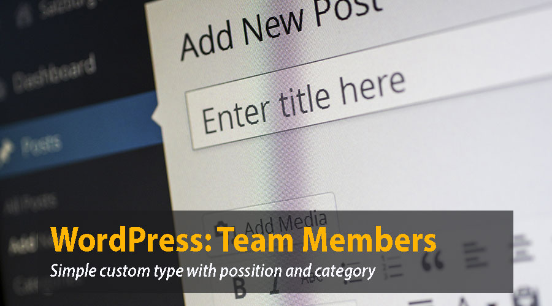

# WordPress Simple content type plugin to manage Team Members
This is a very simple plugin not even worth it to pubish in the wordpress repository.
But anyway a good sample if you need to implement custom types.
Instead of add the custom types in your theme I like the plugin aproach because you can re use it in multiples sites and then update the different releases throug composer.

##You can see a demo at:
http://wp-brixton.oe-lab.tk/

##How to change for your own use
You will find 2 main files:

###oe-team-members.php
here we add the functionality we want to have and the admin menu

###single-team-members.php
this is the template for the single post page
